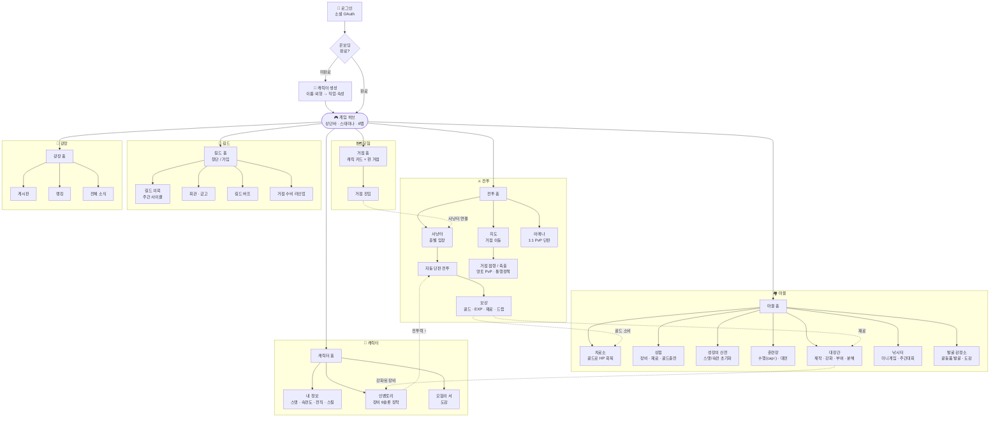

# 게임 구조도 (v2)

로그인 → 캐릭터 생성 → 6탭 허브 구조. 핵심은 "전투 → 보상 → 성장 → 더 강한 전투" 루프.

## 구조 요약

- **진입 흐름**: 로그인(OAuth) → 온보딩 게이트(`OnboardingGate`)가 프로필+직업 미설정 시 `/create`로 보냄 → 캐릭터 생성 후 허브(`/`)로.
- **허브**: `(game)` 라우트 그룹 공유 레이아웃. `GameChrome`이 상단바·스태미나·배경·6탭을 항상 유지(페이지 전환에도 상태 보존).
- **6 메인 탭**: 모험 / 전투 / 마을 / 캐릭터 / 길드 / 광장.
- **핵심 루프(점선)**: 전투 → 골드·EXP·재료 → (치료소에서 골드로 HP회복 + 대장간에서 재료로 제작·강화) → 장비 장착 → 전투력↑ → 더 강한 전투. 골드가 HP 회복 통화로 이중 역할을 하는 게 이 경제의 축.
